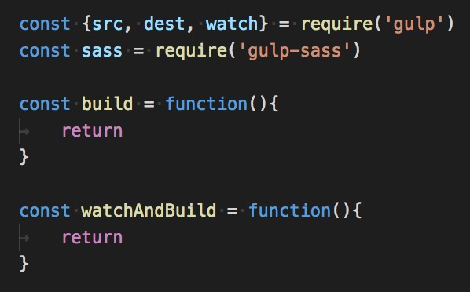

# Sass Flag

Recreate Old Glory using Sass!

## Installation

1. Fork this repo.
2. Clone it.

```sh
$ cd sassflag
$ npm install
$ npm run serve
# Open localhost:8080
```

## Part 1: Sass

Fill in the blanks in `./src/main.scss` to make the American flag appear!

* You will *not* need to change `index.html`.
* You will *not* need to change the "no touchy" line.
* The only place you'll need to add new lines of code is the part where you make the stripes red. **Do this last!** Everything else is just finishing the lines that have already been written.

## Part 1.5: Deploy to GitHub Pages

1. Add, commit, and push the changes you've made so far.
2. In GitHub, click on the 'Settings' tab of your repo.
3. Scroll down to the 'GitHub Pages' section.
4. Under 'Source', select 'master branch'.
5. Wait 10 seconds.
6. Go to `https://yourGitHubUsername.github.io/sassflag`. Easy peasy!
7. To deploy changes, just add, commit, and push again, then wait another 10 seconds for GitHub to catch up.

## Part 2: Gulp

1. Ctrl-C to stop `npm run serve`.
2. Create a new file called `gulpfile.js`.
3. Make it look like this:

	
4. Fill in the rest such that when you run `npm start`, then make changes to `main.scss`, you see those changes automatically show up on the page `localhost:8080`.
